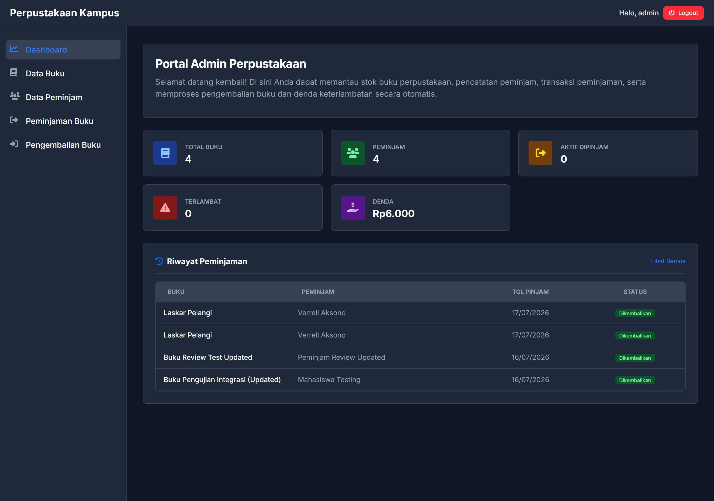

# Sistem Informasi Perpustakaan Kampus

Aplikasi Web Manajemen Perpustakaan Kampus yang dibangun untuk memenuhi kebutuhan proyek UAS Pemrograman Web. Aplikasi ini mempermudah admin perpustakaan dalam mengelola data buku, data peminjam (anggota), serta mencatat transaksi peminjaman dan pengembalian buku secara efisien.



---

## 🚀 Fitur Utama

- **Autentikasi Admin**: Sistem login aman untuk admin perpustakaan menggunakan enkripsi kata sandi `bcrypt`.
- **Manajemen Buku (CRUD)**: Menambah, melihat, memperbarui, dan menghapus data buku dengan validasi ISBN unik dan stok.
- **Manajemen Peminjam (CRUD)**: Mengelola data anggota perpustakaan menggunakan NIM sebagai identitas utama dan email unik.
- **Transaksi Peminjaman**: Pencatatan peminjaman buku dengan pengurangan stok otomatis. Buku dengan stok habis tidak dapat dipinjam.
- **Transaksi Pengembalian**: Pencatatan pengembalian buku dengan pemulihan stok otomatis serta perhitungan denda keterlambatan secara otomatis.
- **Pencarian Buku**: Fitur pencarian buku berdasarkan judul secara cepat dengan optimalisasi indeks database.

---

## 🛠️ Tech Stack

- **Frontend**: HTML5, Tailwind CSS, Flowbite Components, Vanilla JavaScript.
- **Backend**: Node.js, Express.js.
- **Database**: MySQL.
- **Keamanan**: `bcryptjs` untuk enkripsi password, `jsonwebtoken` (JWT) untuk autentikasi API.

---

## 📂 Struktur Folder Proyek

```text
perpustakaan-kampus/
│
├── controllers/          # Logika bisnis
│   ├── authController.js
│   ├── bukuController.js
│   ├── peminjamController.js
│   └── peminjamanController.js
│
├── models/               # Model database dan interaksi query MySQL
│   ├── db.js             # Inisialisasi database & tabel otomatis
│   ├── bukuModel.js
│   ├── peminjamModel.js
│   ├── peminjamanModel.js
│   └── userModel.js
│
├── routes/               # Definisi routing REST API
│   ├── authRoutes.js
│   ├── bukuRoutes.js
│   ├── peminjamRoutes.js
│   └── peminjamanRoutes.js
│
├── middlewares/          # Middleware Express (Auth)
│   └── authMiddleware.js
│
├── public/               # File Frontend Statis
│   ├── pages/            # Halaman HTML (login, dashboard, buku, dll)
│   ├── js/               # Logika frontend & integrasi API (Fetch)
│   ├── css/              # Styling utama (compiled Tailwind CSS)
│   └── assets/           # Gambar, logo, dan ikon
│
├── .env                  # Konfigurasi Environment (Port, Database, JWT Secret)
├── package.json          # Manajemen dependensi Node.js
├── server.js             # server aplikasi menggunakan Express
└── perpustakaan.sql      # Struktur skema basis data
```

---

## 🔑 Kredensial Login Default (Admin)

Untuk masuk ke panel manajemen perpustakaan, gunakan kredensial berikut:

| Field        | Kredensial |
| :----------- | :--------- |
| **Username** | `admin`    |
| **Password** | `admin123` |

_(Akun admin ini akan dibuat secara otomatis di database saat aplikasi dijalankan)._

---

## ⚙️ Persyaratan Sistem & Instalasi

### 1. Prasyarat

Pastikan komputer Anda sudah terinstal:

- [Node.js](https://nodejs.org/) (versi 16 atau lebih baru)
- [MySQL Server](https://www.mysql.com/)

### 2. Instalasi Dependensi

Clone/unduh repositori ini, buka terminal di folder proyek, lalu jalankan:

```bash
npm install
```

### 3. Konfigurasi Environment (`.env`)

Buat file `.env` di root direktori dan sesuaikan konfigurasinya dengan MySQL lokal Anda:

```env
PORT=3000
DB_HOST=   # Sesuaikan dengan host MySQL Anda
DB_USER=   # Sesuaikan dengan username MySQL Anda
DB_PASSWORD=   # Sesuaikan dengan password MySQL Anda
DB_NAME=   # Sesuaikan dengan nama database Anda
JWT_SECRET=   # Sesuaikan dengan secret key Anda
```

### 4. Menjalankan Aplikasi

Jalankan server dalam mode pengembangan menggunakan `nodemon`:

```bash
npm run dev
```

Setelah server berjalan, database dan tabel-tabel yang diperlukan akan **dibuat secara otomatis** oleh sistem (`models/db.js`).

Buka browser Anda dan akses:
**`http://localhost:3000`** (otomatis dialihkan ke halaman Login)

---

## ⚖️ Aturan Bisnis Aplikasi

1. **Buku**:
    - ISBN bersifat unik untuk setiap buku.
    - Stok tidak boleh bernilai negatif.
    - Buku yang sedang aktif dipinjam atau memiliki riwayat peminjaman tidak boleh dihapus demi menjaga integritas data relasional database.

2. **Peminjam (Anggota)**:
    - Email bersifat unik.
    - NIM bersifat unik dan menjadi kunci utama identitas peminjam.

3. **Peminjaman & Pengembalian**:
    - Batas tanggal pengembalian saat peminjaman tidak boleh di masa lalu.
    - Setiap peminjaman buku akan mengurangi stok buku sebanyak `1`.
    - Pengembalian buku yang terlambat dikenakan denda sebesar **Rp2.000 per hari**.
    - Pengembalian buku akan mengembalikan stok buku sebanyak `1`.
